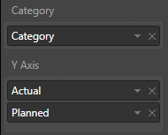
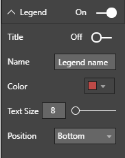
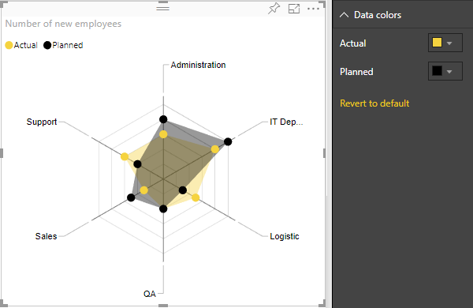
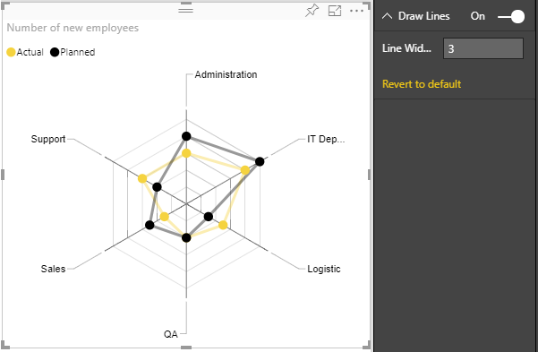
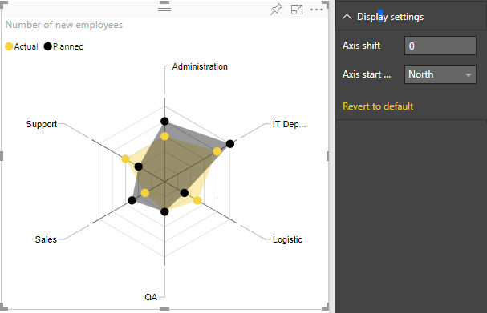
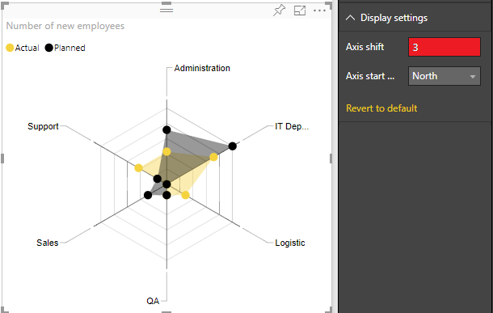
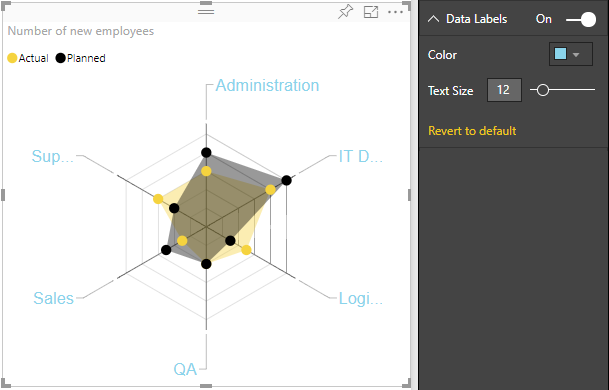

# PowerBI-visuals-RadarChart
 

> A simple radar chart supporting multiple measures plotted over a categorical axis. Also known as a web chart, spider chart, or star chart. Use to display performance metrics for quality improvement.

# Overview
A radar chart is a graphical method of displaying multivariate data in the form of a two-dimensional chart of three or more quantitative variables represented on axes starting from the same point. The relative position and angle of the axes is typically uninformative.

Each variable is provided an axis that starts from the center. All axes are arranged radially, with equal distances between each other, while maintaining the same scale between all axes. Grid lines that connect from axis-to-axis are often used as a guide. Each variable value is plotted along its individual axis and all the variables in a dataset and connected together to form a polygon.

Radar Charts are useful for seeing which variables are scoring high or low within a dataset, making them ideal for displaying performance, such as Skill Analysis of Employee or sport players, product comparison, etc.

See also [Radar Chart at Microsoft Office store](https://store.office.com/en-us/app.aspx?assetid=WA104380771&sourcecorrid=3943ede6-17ac-4e0a-8c2d-53a4ecd3303c&searchapppos=0&ui=en-US&rs=en-US&ad=US&appredirect=false)

### RadarChart has 3 bucket fields: Category, Values and Images.
1. Category - Field with a list of categories for each "radar" item. String values
2. Y axis - Field with values for Category field. It can accept many values. Also this field is used for cross filtering with other visuals.

# Selection
You can select any data point for data filtering and also you can use multi selection but only for one coverage area. For cleaning of selection you should click outside to "Сlear" button on the right top corner of a visual.

# Settings of RadarChart
### Legend

- Title: On/Off legend title
- Name: title name
- Color: color of legend captions.
- Position: position of legend - Top, Bottom, Left, Right, Top Center, Bottom Center, Left Center, Right Center
- Text Size: size of legend text

### Data colors

- Change color of each of categories

### Draw lines - To show lines instead of shaded area

- LineWidth: set the width of lines

### Display Settings
- Axis start: The value of this parameter indicates the beginning of the axis. By default Axis start is set to 0 if all values in DataSet are positive, but if data set contains values less then 0, then it'll be minimum dataset value under 0. Axis start cannot be greater than minimum value of dataset values. You can compare the difference when Axis start is changed on next two images:

- Axis start position: set the starting axis position North or South. You can see the difference on the next picture:

### Data labels
- Color: set color of data labels
- Text size: set text font size of data labels 

